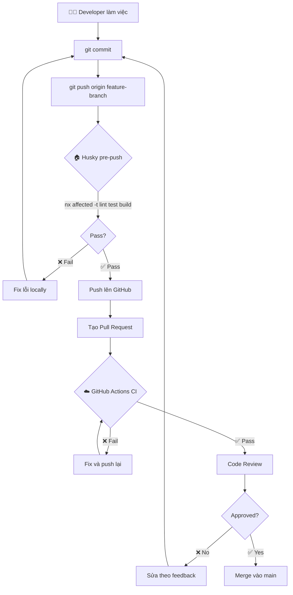
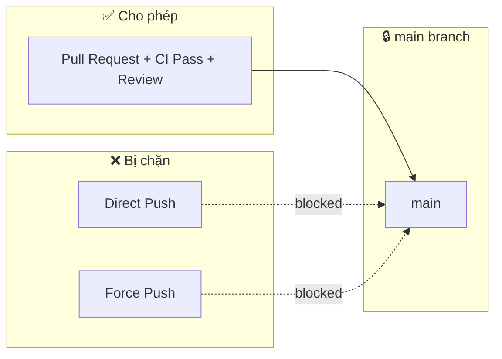

# Developer Workflow Guide

Hướng dẫn quy trình làm việc và CI/CD cho FE-Repo.

---

## 🔄 Workflow Overview



---

## 🛡️ Branch Protection



---

## 📋 Setup Step-by-Step

### Step 1: Cài đặt Husky

```bash
# Cài đặt husky như devDependency
pnpm add -D husky

# Khởi tạo husky (tạo folder .husky)
pnpm exec husky init
```

### Step 2: Tạo pre-push hook

Mở file `.husky/pre-push` và thay nội dung bằng:

```bash
#!/usr/bin/env sh
. "$(dirname -- "$0")/_/husky.sh"

echo "🔍 Running pre-push checks..."

# Chạy lint, test, build trên affected projects
pnpm exec nx affected -t lint test build --base=origin/main --head=HEAD

if [ $? -ne 0 ]; then
  echo "❌ Pre-push checks failed. Please fix the errors before pushing."
  exit 1
fi

echo "✅ Pre-push checks passed!"
```

### Step 3: Tạo GitHub Actions CI

Tạo file `.github/workflows/ci.yml`:

```yaml
name: CI

on:
  push:
    branches: [main, master]
  pull_request:
    branches: [main, master]

permissions:
  actions: read
  contents: read

jobs:
  main:
    runs-on: ubuntu-latest
    steps:
      - uses: actions/checkout@v4
        with:
          fetch-depth: 0

      - uses: pnpm/action-setup@v2
        with:
          version: 9

      - uses: actions/setup-node@v4
        with:
          node-version: 20
          cache: 'pnpm'

      - run: pnpm install --frozen-lockfile

      - uses: nrwl/nx-set-shas@v4

      - run: pnpm exec nx affected -t lint test build
```

### Step 4: Configure GitHub Branch Protection

1. Vào GitHub repo → **Settings** → **Branches**
2. Click **Add branch protection rule**
3. Branch name pattern: `main`
4. Bật các options:
   - ✅ **Require a pull request before merging**
   - ✅ **Require status checks to pass before merging**
     - Search và chọn: `main` (job CI)
   - ✅ **Require branches to be up to date before merging**
   - ✅ **Do not allow bypassing the above settings**
5. Click **Create**

### Step 5: Test workflow

```bash
# Tạo branch mới
git checkout -b test/workflow

# Tạo thay đổi nhỏ
echo "// test" >> apps/web/src/app/page.tsx

# Commit
git add .
git commit -m "test: verify workflow"

# Push (Husky sẽ chạy pre-push hook)
git push origin test/workflow
```

---

## 🎯 Quick Reference

| Command                          | Mục đích                |
| -------------------------------- | ----------------------- |
| `nx affected -t lint`            | Lint affected projects  |
| `nx affected -t test`            | Test affected projects  |
| `nx affected -t build`           | Build affected projects |
| `nx affected -t lint test build` | Chạy tất cả             |
| `nx graph --affected`            | Xem affected graph      |

---

## ❓ Troubleshooting

### Husky không chạy?

```bash
# Đảm bảo hooks được cài
pnpm exec husky install
chmod +x .husky/pre-push
```

### Muốn skip pre-push (emergency)?

```bash
git push --no-verify
```

> ⚠️ Chỉ dùng khi thật sự cần thiết!
